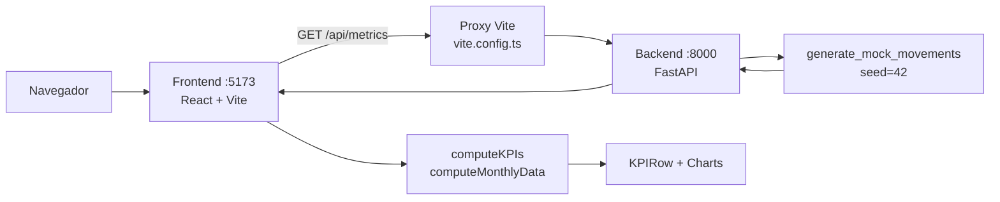

# Contexto del handover — Financial Dashboard

Documento de Fase 1: comprensión y validación del repositorio contra el código real.

**Repositorio:** fork de [4GeeksAcademy/ai-eng-financial-dashboard-context-project](https://github.com/4GeeksAcademy/ai-eng-financial-dashboard-context-project)  
**Fecha de análisis:** julio 2026  
**Verificación operativa:** `docker compose up --build` — backend `/health` y `/docs` responden 200; frontend en puerto 5173 responde 200.

---

## 1. Propósito del producto

El proyecto es un **dashboard de métricas financieras** que visualiza ingresos, egresos, beneficio neto y porcentaje de beneficio a partir de movimientos financieros simulados.

Características confirmadas en código:

- **Sin persistencia:** los datos se generan en memoria con `generate_mock_movements(seed=42)` en `backend/app/routes.py`.
- **Sin autenticación:** todos los endpoints son `GET` públicos.
- **Alcance educativo:** proyecto de contexto para 4Geeks Academy (ver `README.md`).

El frontend presenta KPIs y dos gráficos (ingresos vs egresos por mes, porcentaje de beneficio). La agregación de datos para el dashboard ocurre **en el cliente**, no en el backend.

---

## 2. Mapa de componentes

### Estructura del repositorio

```text
.
├── AGENTS.md                 # Instrucciones para agentes IA
├── README.md / README.es.md  # Documentación de arranque
├── docker-compose.yml        # Orquestación local (frontend + backend)
├── docs/                     # Documentación de gobernanza (este archivo)
├── backend/
│   ├── Dockerfile
│   ├── requirements.txt
│   ├── app/
│   │   ├── main.py           # Entry point FastAPI
│   │   └── routes.py         # Modelos, lógica, mock data y rutas API
│   └── tests/
│       ├── conftest.py
│       └── test_routes.py
└── frontend/
    ├── Dockerfile
    ├── vite.config.ts        # Proxy /api → backend:8000
    ├── index.html
    └── src/
        ├── main.tsx          # Entry point React
        ├── App.tsx           # Página principal, fetch y composición
        ├── components/
        │   ├── dashboard/    # Header, KPIs, gráficos
        │   └── ui/           # Primitivas shadcn (Card, Skeleton)
        └── lib/
            ├── financial-types.ts
            ├── financial-utils.ts
            ├── financial-utils.test.ts
            └── mock-data.ts  # No importado por ningún componente
```

### Flujo de datos



### Entry points clave

| Componente | Archivo | Función |
|------------|---------|---------|
| Orquestación | `docker-compose.yml` | Levanta `frontend` (5173) y `backend` (8000, 5678) con bind-mounts |
| Backend app | `backend/app/main.py` | Crea app FastAPI, CORS, monta router |
| API | `backend/app/routes.py` | 9 endpoints GET, modelos Pydantic, generación mock |
| Frontend | `frontend/src/main.tsx` | Monta `<App />` en `StrictMode` |
| Página | `frontend/src/App.tsx` | Fetch, estados loading/error, layout del dashboard |

---

## 3. Contrato API

### Endpoints expuestos por el backend

| Método | Ruta | `response_model` | Uso en frontend |
|--------|------|------------------|-----------------|
| `GET` | `/health` | — | No usado |
| `GET` | `/api/metrics` | `list[FinancialMovement]` | **Sí** — único endpoint consumido |
| `GET` | `/api/metrics/facets` | `MetricsFacets` | No usado |
| `GET` | `/api/metrics/summary` | `list[MetricsSummaryItem]` | No usado |
| `GET` | `/api/metrics/categories/top` | `list[TopCategoryItem]` | No usado |
| `GET` | `/api/metrics/comparison` | `MetricsComparison` | No usado |
| `GET` | `/api/metrics/alerts` | `list[MetricsAlert]` | No usado |
| `GET` | `/api/metrics/b2b` | `list[FinancialMovement]` | No usado |
| `GET` | `/api/metrics/b2c` | `list[FinancialMovement]` | No usado |

Definiciones en `backend/app/routes.py` (líneas 243–391).

### Consumo real del frontend

```15:20:frontend/src/App.tsx
async function fetchFinancialData(): Promise<FinancialMovement[]> {
  const response = await fetch(`${API_BASE_URL}/api/metrics`);
  if (!response.ok) {
    throw new Error(`Failed to fetch financial data: ${response.status}`);
  }
  return response.json();
}
```

Tras el fetch, `App.tsx` llama a `computeKPIs` y `computeMonthlyData` (`frontend/src/lib/financial-utils.ts`) para derivar métricas y series mensuales localmente.

### Modelo de dominio compartido (implícito)

Backend (`FinancialMovement` en Pydantic):

```22:27:backend/app/routes.py
class FinancialMovement(BaseModel):
    create_date: date
    amount: float
    operation_type: OperationType
    category: Category
    business_type: BusinessType
```

Frontend (`FinancialMovement` en TypeScript):

```5:11:frontend/src/lib/financial-types.ts
export interface FinancialMovement {
  create_date: string // ISO date
  amount: number
  operation_type: OperationType
  category: Category
  business_type: BusinessType
}
```

Los enums coinciden: `OperationType`, `Category`, `BusinessType` definidos como `Literal` en backend y como union types en frontend.

---

## 4. Validación del resumen IA

Sección de corrección de afirmaciones iniciales frente al código inspeccionado.

### Validado

| Afirmación | Evidencia |
|------------|-----------|
| Stack React + TypeScript (frontend) y FastAPI (backend) | `frontend/package.json`, `backend/requirements.txt`, `README.md` |
| Tipado fuerte en API con Pydantic y `response_model` | `routes.py:248` — `@router.get("/api/metrics", response_model=list[FinancialMovement])` |
| Enums restringidos con `Literal` | `routes.py:11-15` — `OperationType`, `Category`, `BusinessType`, `GroupBy` |
| Proxy Vite evita CORS en desarrollo local | `vite.config.ts:11-16` — proxy `/api` → `http://backend:8000` |
| Docker Compose como forma principal de ejecución | `docker-compose.yml`, `README.md:41-43` |
| Tests backend con pytest + TestClient | `backend/tests/test_routes.py` — 15 tests |
| Tests frontend con Vitest en utilidades | `frontend/src/lib/financial-utils.test.ts` |
| Seed fijo para datos reproducibles | `routes.py:94-96` — `random.seed(seed)` cuando `seed=42` |

### Corregido

| Afirmación inicial | Realidad en código |
|--------------------|-------------------|
| "El frontend consume la API completa del backend" | Solo usa `GET /api/metrics`. Los endpoints `/summary`, `/facets`, `/alerts`, etc. existen pero no tienen consumidor en el frontend. |
| "El backend agrega datos para el dashboard" | La agregación (KPIs, series mensuales) ocurre en `financial-utils.ts` del frontend, duplicando capacidad de `/api/metrics/summary`. |
| "`mock-data.ts` alimenta el dashboard" | `frontend/src/lib/mock-data.ts` no es importado por ningún archivo del frontend (búsqueda de referencias: 0 coincidencias). Es código muerto. |
| "El periodo mostrado refleja los datos" | `App.tsx:49` pasa `period="2024 - Full Year"` hardcodeado a `DashboardHeader`, independiente del rango real de la API. |
| "CORS configurado correctamente para producción" | `main.py:7-12` usa `allow_origins=["*"]` con `allow_credentials=True`, combinación inválida según la especificación CORS del navegador. En dev local el proxy de Vite hace innecesario depender de CORS. |

### Rechazado

| Afirmación | Motivo |
|------------|--------|
| "Existe capa de persistencia (DB)" | No hay ORM, migraciones ni archivos de configuración de base de datos en el repositorio. |
| "Existe pipeline CI/CD" | No hay `.github/workflows/`, `Jenkinsfile` ni configuración de despliegue automatizado. |
| "`.agents/rules` y `memory-bank` ya están poblados" | `AGENTS.md` los referencia como ubicaciones esperadas, pero no existían antes de este análisis de gobernanza. |

---

## 5. Setup operativo

### Arranque local

```bash
docker compose up --build
```

| Servicio | URL | Puerto |
|----------|-----|--------|
| Frontend | http://localhost:5173 | 5173 |
| Backend API | http://localhost:8000 | 8000 |
| Swagger / OpenAPI | http://localhost:8000/docs | 8000 |
| Debugpy (backend) | — | 5678 |

### Variables de entorno

Por defecto **no se requieren** variables de entorno. El proxy de Vite reenvía `/api` al contenedor `backend`.

Para apuntar a un backend externo, copiar `frontend/.env.example` a `frontend/.env` y definir `VITE_API_BASE_URL`.

### Nota sobre `node_modules` en Docker

`docker-compose.yml` monta el código fuente del frontend y usa un volumen anónimo para `/app/node_modules`:

```8:10:docker-compose.yml
    volumes:
      - ./frontend:/app
      - /app/node_modules
```

Esto evita que el `node_modules` del host sobrescriba las dependencias instaladas en la imagen. Si aparecen errores de permisos al instalar dependencias localmente fuera de Docker, ejecutar la instalación dentro del contenedor o respetar este patrón de volúmenes.

### Modo de los Dockerfiles

Ambos Dockerfiles están orientados a **desarrollo**, no a producción:

- Backend: `debugpy` + `uvicorn --reload` (`backend/Dockerfile:12`)
- Frontend: `npm run dev` (`frontend/Dockerfile:12`)

---

## 6. Handover incompleto — brechas documentales

Al inicio del análisis se identificaron estas brechas de conocimiento transferido:

1. Sin estándares de código explícitos (`.agents/rules` vacío).
2. Sin memoria operativa del proyecto (`memory-bank` inexistente).
3. Sin registro de decisiones de arquitectura (ADR).
4. Documentación de producto limitada al README de arranque.
5. Desalineación entre capacidades del backend (9 endpoints) y uso real del frontend (1 endpoint).

Los artefactos de las Fases 2–4 de este plan de gobernanza abordan estas brechas.
