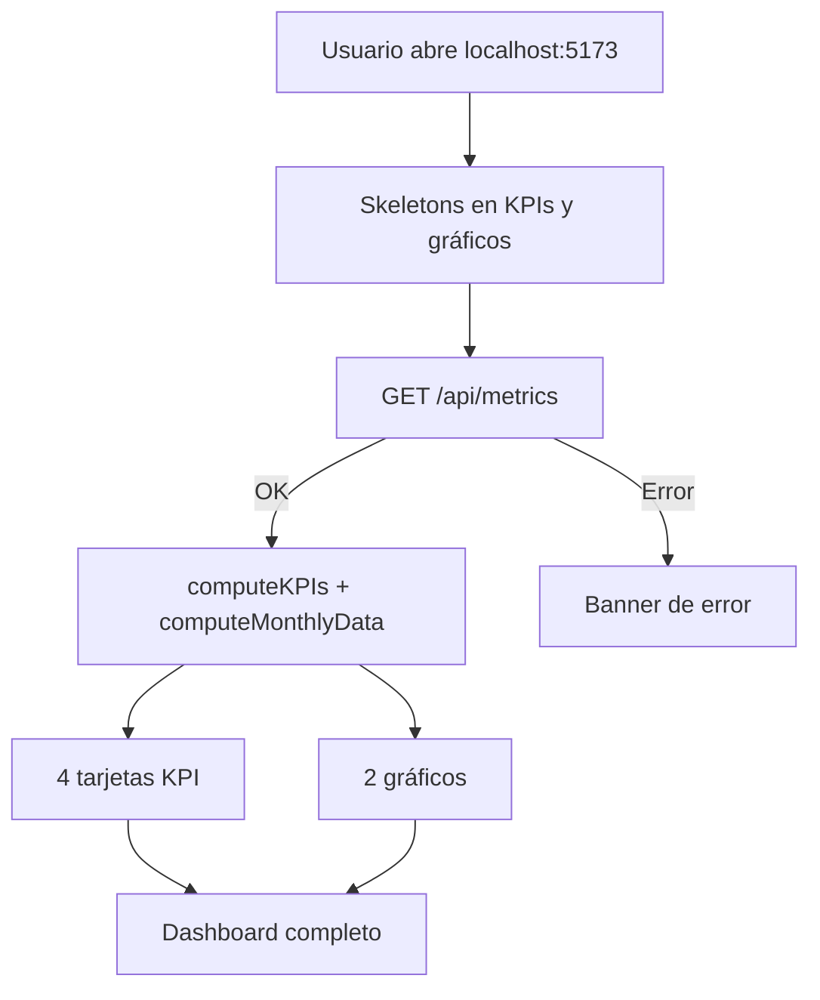

# Product Overview — Financial Metrics Dashboard

Memoria operativa del producto. Basada en inspección de `README.md`, `App.tsx`, componentes del dashboard y `backend/app/routes.py`.

---

## Qué es

**Financial Metrics Dashboard** es una aplicación web que visualiza métricas financieras de una empresa simulada: ingresos totales, egresos totales, beneficio neto y margen de beneficio (%), junto con gráficos de evolución mensual.

No es un sistema contable real: los datos provienen de movimientos financieros **generados en memoria** por el backend (mock con `seed=42`). No hay base de datos ni autenticación.

## Para quién

- Proyecto educativo de **4Geeks Academy** (AI Engineering context project).
- Contribuidores y agentes IA que mantienen el fork y documentan gobernanza del código.
- Usuarios de demo que ejecutan `docker compose up --build` para explorar un dashboard financiero.

## Flujo de usuario

1. El usuario accede al frontend (puerto 5173).
2. Durante la carga se muestran skeletons en tarjetas y gráficos.
3. Si el backend responde, se calculan métricas y se renderiza el dashboard.
4. Si falla el fetch, aparece un mensaje de error en banner rojo.

## Componentes principales

| Componente | Archivo | Función |
|------------|---------|---------|
| Página raíz | `frontend/src/App.tsx` | Fetch, estados loading/error, layout |
| Header | `components/dashboard/dashboard-header.tsx` | Título y periodo (actualmente hardcodeado) |
| KPIs | `components/dashboard/kpi-row.tsx` | 4 tarjetas: Income, Outcome, Profit, Profit Margin |
| Tarjeta KPI | `components/dashboard/kpi-card.tsx` | Presentación individual con icono y skeleton |
| Gráfico ingresos/egresos | `components/dashboard/income-outcome-chart.tsx` | Bar chart mensual (Recharts) |
| Gráfico margen | `components/dashboard/profit-percent-chart.tsx` | Line chart de profit % mensual |

## Métricas mostradas

Definidas en `frontend/src/lib/financial-utils.ts` y derivadas de movimientos crudos:

| Métrica | Cálculo |
|---------|---------|
| Total Income | Suma de `amount` donde `operation_type === "income"` |
| Total Outcome | Suma de `amount` donde `operation_type === "outcome"` |
| Profit | Income − Outcome |
| Profit Margin % | `(profit / income) * 100`, o 0 si income es 0 |

Series mensuales agrupan por `YYYY-MM` del campo `create_date`.

## Modelo de datos

Cada movimiento (`FinancialMovement`) tiene:

| Campo | Valores |
|-------|---------|
| `create_date` | Fecha ISO |
| `amount` | Número (float) |
| `operation_type` | `income` \| `outcome` |
| `category` | `suppliers`, `sales`, `operational`, `administrative`, `others` |
| `business_type` | `B2B` \| `B2C` |

El backend genera ~360 movimientos (30 por mes × 12 meses) con `generate_mock_movements(seed=42)`.

## API consumida vs disponible

**Consumida por el frontend:** solo `GET /api/metrics` (lista completa de movimientos).

**Disponible pero no usada en UI:**

- `/api/metrics/facets` — opciones de filtro
- `/api/metrics/summary` — agregación por día/semana/mes
- `/api/metrics/categories/top` — top categorías
- `/api/metrics/comparison` — comparación de periodos
- `/api/metrics/alerts` — alertas de picos de gasto
- `/api/metrics/b2b`, `/api/metrics/b2c` — filtros por tipo de negocio

Ver contrato completo en `docs/handover-context.md`.

## Limitaciones conocidas del producto

- Periodo mostrado fijo: `"2024 - Full Year"` en `App.tsx` sin derivar del dataset.
- Sin filtros interactivos en UI (aunque la API los soporta).
- Sin exportación, sin auth, sin persistencia.
- Mensaje de error en español; labels UI en inglés.

## Documentación relacionada

- Arranque: `README.md` / `README.es.md`
- Agentes: `AGENTS.md` → `.agents/rules/`
- Handover: `docs/handover-context.md`
- Gobernanza: `docs/engineering-practices-analysis.md`
